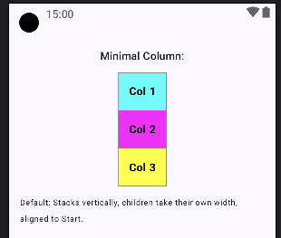

## Components Demonstrated:

1. **Column Demo:**
    * `Column` (Column Minimal)`

```kotlin
@Composable
fun MinimalColumnDemo() {
   // Minimal Column
   Text("Minimal Column:", style = MaterialTheme.typography.titleMedium)
   Column(modifier = Modifier.border(1.dp, Color.Gray)) {
      DemoElement("Col 1", Color.Cyan)
      DemoElement("Col 2", Color.Magenta)
      DemoElement("Col 3", Color.Yellow)
   }
   Text("Default: Stacks vertically, children take their own width, aligned to Start.", fontSize = 12.sp, modifier = Modifier.padding(bottom = 12.dp))
}

// --- Helper Composable for consistent item styling ---
// (Assuming MinimalLayoutsDemo and AdvancedLayoutsDemo are in the same file or accessible)00
@Composable
fun DemoElement(text: String, color: Color, modifier: Modifier = Modifier) {
   Text(
      text = text,
      color = Color.Black,
      fontWeight = FontWeight.Bold,
      fontSize = 16.sp,
      modifier = modifier
         .background(color)
         .padding(16.dp)
   )
}
```



-----