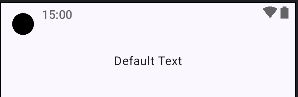

## Components Demonstrated:

1. **Standard Text:**
    * `Text` (Standard Text)`

```kotlin
// Simplest Text composable with default styling.
@Composable
fun StandardText() {
   Text("Default Text")
}
```



-----