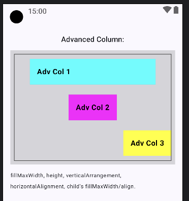

## Components Demonstrated:

1. **Column Demo:**
    * `Column` (Column Minimal)`

```kotlin
@Composable
fun MinimalColumnDemo() {
   // Minimal Column
   Text("Minimal Column:", style = MaterialTheme.typography.titleMedium)
   Column(modifier = Modifier.border(1.dp, Color.Gray)) {
      DemoElement("Col 1", Color.Cyan)
      DemoElement("Col 2", Color.Magenta)
      DemoElement("Col 3", Color.Yellow)
   }
   Text("Default: Stacks vertically, children take their own width, aligned to Start.", fontSize = 12.sp, modifier = Modifier.padding(bottom = 12.dp))
}

// --- Helper Composable for consistent item styling ---
// (Assuming MinimalLayoutsDemo and AdvancedLayoutsDemo are in the same file or accessible)00
@Composable
fun DemoElement(text: String, color: Color, modifier: Modifier = Modifier) {
   Text(
      text = text,
      color = Color.Black,
      fontWeight = FontWeight.Bold,
      fontSize = 16.sp,
      modifier = modifier
         .background(color)
         .padding(16.dp)
   )
}
```


-----

2. **Advanced Column Demo:**
   * `Column` (Column Advanced)`

```kotlin
@Composable
fun AdvancedColumnDemo() {
   // Advanced Column
   Text("Advanced Column:", style = MaterialTheme.typography.titleMedium)
   Column(
      modifier = Modifier
         .fillMaxWidth() // Take full available width
         .height(250.dp)   // Fixed height for demonstration
         .background(Color.DarkGray.copy(alpha = 0.2f))
         .padding(8.dp)
         .border(1.dp, Color.DarkGray),
      verticalArrangement = Arrangement.SpaceAround, // Distribute space
      horizontalAlignment = Alignment.CenterHorizontally // Align children in the center
   ) {
      DemoElement(
         "Adv Col 1",
         Color.Cyan,
         Modifier.fillMaxWidth(0.8f)
      ) // Takes 80% of Column's width
      DemoElement("Adv Col 2", Color.Magenta)
      DemoElement(
         "Adv Col 3",
         Color.Yellow,
         Modifier.align(Alignment.End)
      ) // Override column's horizontalAlignment
   }
   Text("fillMaxWidth, height, verticalArrangement, horizontalAlignment, child's fillMaxWidth/align.", fontSize = 12.sp, modifier = Modifier.padding(bottom = 12.dp))

   Spacer(modifier = Modifier.height(16.dp))
}

```



-----