## Components Demonstrated:

1. **Standard Buttons:**
    * `Button` (Filled Button - default)

```kotlin
@Composable
fun ButtonContent(name: String, content: Context) {
    Button(onClick = {
        Toast.makeText(content, "Button Clicked", Toast.LENGTH_SHORT).show()
    }) {
        Text(name)
    }
}
```

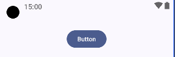

-----

2. **Filled Buttons with Icon:**
    * `Button` (Filled Button with Icon- default)

```kotlin
@Composable
fun ButtonTypeFilledWithIcon(context: Context) {
    // Filled Button (default): High emphasis, for primary actions.
    Button(onClick = {
        Toast.makeText(context, "Filled Button Clicked", Toast.LENGTH_SHORT).show()
    }) {
        Icon(
            Icons.Filled.Favorite,
            contentDescription = "Favorite",
            modifier = Modifier.size(ButtonDefaults.IconSize)
        )
        Spacer(Modifier.size(ButtonDefaults.IconSpacing)) // Standard spacing between icon and text.
        Text("Filled Button")
    }
}
```

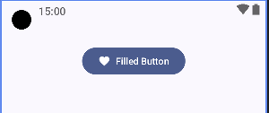


-----
3. **Filled Tonal Buttons with Icon:**

* `FilledTonalButton` (Filled Tonal Button with Icon- default)

```kotlin
@Composable
fun ButtonTypeFilledTonalButton(context: Context) {
    // FilledTonalButton: Medium emphasis, a softer alternative to FilledButton.
    // Good for actions like "Next" in a wizard or secondary prominent actions.
    FilledTonalButton(onClick = {
        Toast.makeText(
            context,
            "Filled Tonal Button Clicked",
            Toast.LENGTH_SHORT
        ).show()
    }) {
        Icon(
            Icons.Filled.ShoppingCart,
            contentDescription = "Cart",
            modifier = Modifier.size(ButtonDefaults.IconSize)
        )
        Spacer(Modifier.size(ButtonDefaults.IconSpacing))
        Text("Filled Tonal")
    }
}
```

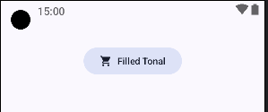

-----
4. **OutlinedButton:**

* `OutlinedButton` (OutlinedButton- default)

```kotlin
@Composable
fun OutlinedButtonContent(context: Context) {
   OutlinedButton(onClick = { Toast.makeText(context, "Outlined Button Clicked", Toast.LENGTH_SHORT).show() }) {
      Icon(Icons.Filled.Call, contentDescription = "Call", modifier = Modifier.size(ButtonDefaults.IconSize))
      Spacer(Modifier.size(ButtonDefaults.IconSpacing))
      Text("Outlined Button")
   }
}
```

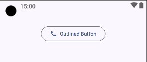
-----
5. **ElevatedButton:**

* `ElevatedButton` (ElevatedButton- default)

```kotlin
@Composable
fun ElevatedButtonContent(context: Context) {
   ElevatedButton(onClick = { Toast.makeText(context, "Elevated Button Clicked", Toast.LENGTH_SHORT).show() }) {
      Icon(Icons.Filled.Add, contentDescription = "Add", modifier = Modifier.size(ButtonDefaults.IconSize))
      Spacer(Modifier.size(ButtonDefaults.IconSpacing))
      Text("Elevated Button")
   }
}
```

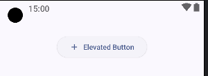
-----
6. **TextButton:**

* `TextButton` (TextButton- default)

```kotlin
@Composable
fun TextButtonContent(context: Context) {
   TextButton(onClick = { Toast.makeText(context, "Text Button Clicked", Toast.LENGTH_SHORT).show() }) {
      Text("Text Button")
   }
}
```

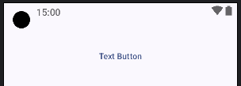
-----
7. **IconButton:**

* `IconButton` (IconButton- default)

```kotlin
@Composable
fun IconButtonContent(context: Context) {
   Row(horizontalArrangement = Arrangement.spacedBy(8.dp)) { // Arrange IconButtons in a row.
      // Standard IconButton.
      IconButton(onClick = { Toast.makeText(context, "Menu Icon Clicked", Toast.LENGTH_SHORT).show() }) {
         Icon(Icons.Filled.Menu, contentDescription = "Menu")
      }

      // Disabled IconButton.
      IconButton(onClick = { /* Will not be called */ }, enabled = false) {
         Icon(Icons.Filled.Lock, contentDescription = "Disabled Lock")
      }

      // IconButton with custom colors (example).
      // Note: For proper theming, it's better to customize colors via the ButtonColors parameter in the theme.
      IconButton(
         onClick = { Toast.makeText(context, "Favorite Icon Clicked", Toast.LENGTH_SHORT).show() },
         colors = IconButtonDefaults.iconButtonColors(
            contentColor = MaterialTheme.colorScheme.primary, // Color of the icon itself.
            disabledContentColor = MaterialTheme.colorScheme.onSurface.copy(alpha = 0.38f)
         )
      ) {
         Icon(Icons.Filled.Favorite, contentDescription = "Favorite with custom color")
      }
   }
}
```

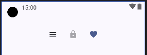
-----
8. **FabButton:**

* `FabButton` (FabButton- default)

```kotlin
@Composable
fun FabButtonContent(context: Context) {
      // Standard FloatingActionButton.
      FloatingActionButton(
         onClick = { Toast.makeText(context, "FAB Clicked", Toast.LENGTH_SHORT).show() },
         containerColor = MaterialTheme.colorScheme.secondaryContainer // Example of custom container color.
      ) {
         Icon(Icons.Filled.Edit, "Edit FAB")
      }

      // SmallFloatingActionButton: For less prominent actions or tight spaces.
      SmallFloatingActionButton(
         onClick = { Toast.makeText(context, "Small FAB Clicked", Toast.LENGTH_SHORT).show() }
      ) {
         Icon(Icons.Filled.Add, "Small Add FAB")
      }

      // LargeFloatingActionButton: For very prominent actions.
      LargeFloatingActionButton(
         onClick = { Toast.makeText(context, "Large FAB Clicked", Toast.LENGTH_SHORT).show() },
         shape = CircleShape // Default shape, but can be customized.
      ) {
         Icon(Icons.Filled.ShoppingCart, "Large Cart FAB", modifier = Modifier.size(FloatingActionButtonDefaults.LargeIconSize))
      }

      // ExtendedFloatingActionButton (can also be used inline).
      // Shows both an icon and text.
      ExtendedFloatingActionButton(
         icon = { Icon(Icons.Filled.Call, "Call Icon") },
         text = { Text("Call Support") },
         onClick = { Toast.makeText(context, "Extended FAB (inline) Clicked", Toast.LENGTH_SHORT).show() }
      )
   }
```

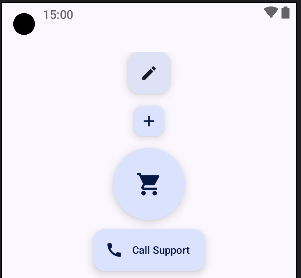
-----
9. **EnabledDisabledButton:**

* `EnabledDisabledButton` (EnabledDisabledButton- default)

```kotlin
@Composable
fun EnabledDisabledButtonContent(context: Context) {
   var isButtonEnabled by remember { mutableStateOf(true) } // State to toggle button enabled status.

   // Button with enabled state controlled by a variable.
   Button(
      onClick = { Toast.makeText(context, "Toggled Button Clicked", Toast.LENGTH_SHORT).show() },
      enabled = isButtonEnabled // Dynamically sets the enabled state.
   ) {
      Text(if (isButtonEnabled) "Enabled Button" else "Disabled Button")
   }

   Button(
      onClick = { Toast.makeText(context, "Toggled Button Clicked", Toast.LENGTH_SHORT).show() },
      enabled = !isButtonEnabled // Dynamically sets the enabled state.
   ) {
      Text(if (!isButtonEnabled) "Enabled Button" else "Disabled Button")
   }

   // Button to toggle the enabled state of the button above.
   TextButton(onClick = { isButtonEnabled = !isButtonEnabled }) {
      Text(if (isButtonEnabled) "Disable Above Button" else "Enable Above Button")
   }
}
```

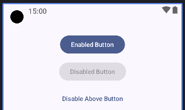
-----
10. **ButtonPadding:**

* `ButtonPadding` (ButtonPadding- default)

```kotlin
@Composable
fun ButtonPaddingContent(context: Context) {
   Button(
      onClick = { Toast.makeText(context, "Custom Padding Button", Toast.LENGTH_SHORT).show() },
      contentPadding = PaddingValues(horizontal = 32.dp, vertical = 16.dp) // Larger padding.
   ) {
      Text("Custom Padding")
   }
}
```

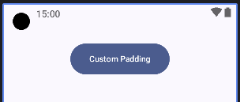
-----
11. **ButtonCustomShape:**

* `ButtonCustomShape` (ButtonCustomShape- default)

```kotlin
@Composable
fun ButtonCustomShapeContent(context: Context) {
   Button(
      onClick = { Toast.makeText(context, "Custom Shape Button", Toast.LENGTH_SHORT).show() },
      shape = CutCornerShape(topStart = 12.dp, bottomEnd = 12.dp) // Example of a cut corner shape.
   ) {
      Text("Custom Shape")
   }
}
```

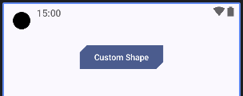
-----
12. **ButtonColorDemo:**

* `ButtonColorDemo` (ButtonColorDemo- default)

```kotlin
@Composable
fun ButtonColorDemoContent(context: Context) {
   Button(
      onClick = { Toast.makeText(context, "Custom Colors Button", Toast.LENGTH_SHORT).show() },
      colors = ButtonDefaults.buttonColors(
         containerColor = Color.Magenta, // Custom background/container color.
         contentColor = Color.White,     // Custom text/icon color.
         disabledContainerColor = Color.Gray,
         disabledContentColor = Color.DarkGray
      )
   ) {
      Text("Custom Colors")
   }
}
```

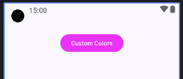
-----