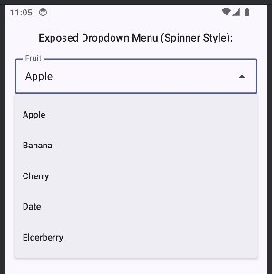
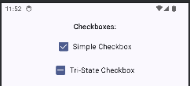

## Components Demonstrated:

1. **ExposedDropdownMenuDemo:** Text:**
    * `ExposedDropdownMenu` (ExposedDropdownMenu Text)`

```kotlin
@Composable
fun DropdownMenuDemo(context: android.content.Context) {
   var expanded by remember { mutableStateOf(false) }
   val suggestions = listOf("Apple", "Banana", "Cherry", "Date", "Elderberry")
   var selectedText by remember { mutableStateOf(suggestions[0]) }

   Text("Exposed Dropdown Menu (Spinner Style):", style = MaterialTheme.typography.titleMedium)
   ExposedDropdownMenuBox(
      expanded = expanded,
      onExpandedChange = { expanded = !expanded }
   ) {
      OutlinedTextField(
         value = selectedText,
         onValueChange = { /* Usually read-only or type to filter */ },
         readOnly = true,
         label = { Text("Fruit") },
         trailingIcon = { ExposedDropdownMenuDefaults.TrailingIcon(expanded = expanded) },
         modifier = Modifier
            .menuAnchor() // This is important!
            .fillMaxWidth()
      )
      ExposedDropdownMenu(
         expanded = expanded,
         onDismissRequest = { expanded = false }
      ) {
         suggestions.forEach { label ->
            DropdownMenuItem(
               text = { Text(text = label) },
               onClick = {
                  selectedText = label
                  expanded = false
                  Toast.makeText(context, "Selected: $label", Toast.LENGTH_SHORT).show()
               }
            )
         }
      }
   }
}
```



-----

2. **CheckBoxDemo:** Text:**
   * `Checkbox` (Checkbox Text)`

```kotlin
@Composable
fun CheckboxDemo(context: android.content.Context) {
   var checkedState by remember { mutableStateOf(true) }
   var triState by remember { mutableStateOf(androidx.compose.ui.state.ToggleableState.Indeterminate) }

   Text("Checkboxes:", style = MaterialTheme.typography.titleMedium)
   Row(
      verticalAlignment = Alignment.CenterVertically,
      modifier = Modifier
         //.fillMaxWidth() // REMOVED - Row will now wrap its content//It Makes the whole row take width
         .toggleable(
            value = checkedState,
            onValueChange = {
               checkedState = it
               Toast
                  .makeText(context, "Checkbox: $it", Toast.LENGTH_SHORT)
                  .show()
            },
            role = Role.Checkbox // Important for accessibility
         )
         .padding(vertical = 8.dp) // Add some padding for better tap target
   ) {
      Checkbox(
         checked = checkedState,
         onCheckedChange = null
      )
      Text(
         text = "Simple Checkbox",
         modifier = Modifier.padding(start = 8.dp) // Padding between checkbox and text
      )
   }

   // Tri-State Checkbox Row - Wrap Content
   Row(
      verticalAlignment = Alignment.CenterVertically,
      modifier = Modifier
         .clickable( // Using clickable for simpler TriState logic handling from Row
            onClick = {
               val newState = when (triState) {
                  ToggleableState.On -> ToggleableState.Off
                  ToggleableState.Off -> ToggleableState.Indeterminate
                  ToggleableState.Indeterminate -> ToggleableState.On
               }
               triState = newState
               Toast
                  .makeText(context, "TriStateCheckbox: $newState", Toast.LENGTH_SHORT)
                  .show()
            },
            role = Role.Checkbox,
            interactionSource = remember { MutableInteractionSource() },
            indication = ripple(
               bounded = true,
               radius = Dp.Unspecified, // Or specific Dp value
               color = Color.Unspecified // Or specific Color
            ) // NEW WAY
         )
         .padding(vertical = 8.dp, horizontal = 4.dp) // Added small horizontal padding
   ) {
      TriStateCheckbox(
         state = triState,
         onClick = null // Handled by clickable Row
      )
      Text(
         text = "Tri-State Checkbox",
         modifier = Modifier.padding(start = 8.dp)
      )
   }
}
```



-----