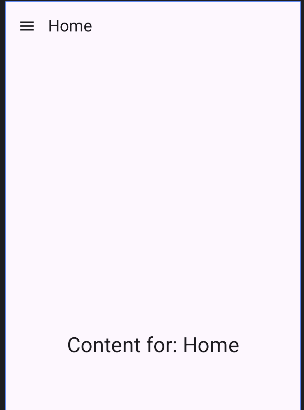
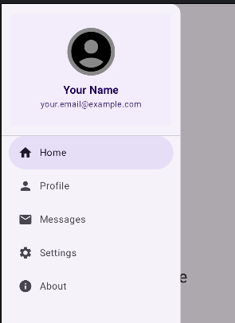

## Components Demonstrated:

1. **NavigationDrawer:**
    * `NavigationDrawer` (NavigationDrawer)`

```kotlin
@OptIn(ExperimentalMaterial3Api::class)
@Composable
fun NavigationDrawerExampleScreen(navController: NavController) {
   val context = LocalContext.current
   val drawerState = rememberDrawerState(initialValue = DrawerValue.Closed)
   val scope = rememberCoroutineScope()
   var selectedItemIdentifier by remember { mutableStateOf(DrawerScreens.Home.identifier) }
   var currentScreenTitle by remember { mutableStateOf(DrawerScreens.Home.title) }
   ModalNavigationDrawer(
      drawerState = drawerState,
      drawerContent = {
         ModalDrawerSheet(
            modifier = Modifier.width(300.dp)
         ) {
            DrawerHeader(
               modifier = Modifier.padding(16.dp)
            )
            HorizontalDivider()
            DrawerScreens.values().forEach { screen ->
               NavigationDrawerItem(
                  icon = { Icon(screen.icon, contentDescription = screen.title) },
                  label = { Text(screen.title) },
                  selected = screen.identifier == selectedItemIdentifier,
                  onClick = {
                     selectedItemIdentifier = screen.identifier
                     currentScreenTitle = screen.title
                     scope.launch {
                        drawerState.close()
                     }
                     Toast.makeText(context, "${screen.title} Clicked", Toast.LENGTH_SHORT).show()
                  },
                  modifier = Modifier.padding(NavigationDrawerItemDefaults.ItemPadding)
               )
            }
            Spacer(Modifier.weight(1f)) // Pushes logout to the bottom
            HorizontalDivider()
            NavigationDrawerItem(
               icon = { Icon(Icons.AutoMirrored.Filled.ExitToApp, "Logout") },
               label = { Text("Logout") },
               selected = false,
               onClick = {
                  scope.launch { drawerState.close() }
                  Toast.makeText(context, "Logout Clicked", Toast.LENGTH_SHORT).show()
               },
               modifier = Modifier.padding(NavigationDrawerItemDefaults.ItemPadding)
            )
            Spacer(modifier = Modifier.height(16.dp)) // Some padding at the bottom
         }
      }
   ) {
      Scaffold(
         topBar = {
            TopAppBar(
               title = { Text(currentScreenTitle) }, // Display the title of the current "screen".
               navigationIcon = {
                  // The navigation icon (typically a "hamburger" menu icon) opens the drawer.
                  IconButton(onClick = {
                     scope.launch { // Launch a coroutine to smoothly open the drawer.
                        drawerState.open()
                     }
                  }) {
                     Icon(
                        imageVector = Icons.Filled.Menu,
                        contentDescription = "Open Navigation Drawer"
                     )
                  }
               },
               // Optional: Back button if deeper in navigation stack and not at a root drawer destination
               actions = {
                  if (navController.previousBackStackEntry != null &&
                     !DrawerScreens.values().any { it.identifier == selectedItemIdentifier }) { // Show back if not a root screen
                     IconButton(onClick = { navController.navigateUp() }) {
                        Icon(Icons.AutoMirrored.Filled.ArrowBack, "Back")
                     }
                  }
               }
            )
         }
      ) { paddingValues ->
         Box(
            modifier = Modifier
               .fillMaxSize()
               .padding(paddingValues)
               .padding(16.dp),
            contentAlignment = Alignment.Center
         ) {
            Text(
               text = "Content for: $currentScreenTitle",
               style = MaterialTheme.typography.headlineMedium,
               textAlign = TextAlign.Center
            )
         }
      }
   }
}
enum class DrawerScreens(
   val identifier: String,
   val title: String,
   val icon: ImageVector
) {
   Home("home", "Home", Icons.Filled.Home /*, "home_route" */),
   Profile("profile", "Profile", Icons.Filled.Person /*, "profile_route" */),
   Messages("messages", "Messages", Icons.Filled.Email /*, "messages_route" */),
   Settings("settings", "Settings", Icons.Filled.Settings /*, "settings_route" */),
   About("about", "About", Icons.Filled.Info /*, "about_route" */)
}
@Composable
fun DrawerHeader(modifier: Modifier = Modifier) {
   Column(
      modifier = modifier
         .fillMaxWidth()
         .background(MaterialTheme.colorScheme.primaryContainer.copy(alpha = 0.3f)) // Light background
         .padding(vertical = 24.dp, horizontal = 16.dp),
      horizontalAlignment = Alignment.CenterHorizontally,
      verticalArrangement = Arrangement.Center
   ) {
      Image(
         imageVector = Icons.Filled.AccountCircle,
         contentDescription = "Profile Picture",
         contentScale = ContentScale.Crop,
         modifier = Modifier
            .size(80.dp)
            .clip(CircleShape)
            .background(Color.Gray)
      )
      Spacer(modifier = Modifier.height(12.dp))
      Text(
         text = "Your Name",
         fontSize = 18.sp,
         fontWeight = FontWeight.Bold,
         color = MaterialTheme.colorScheme.onPrimaryContainer
      )
      Text(
         text = "your.email@example.com", // Replace with actual user email
         fontSize = 14.sp,
         color = MaterialTheme.colorScheme.onPrimaryContainer.copy(alpha = 0.8f)
      )
   }
}
```




-----