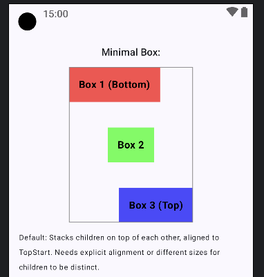
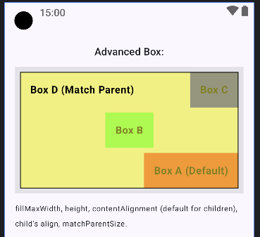

## Components Demonstrated:

1. **Simple Box Demo:**
    * `Box` (Simple Box)`

```kotlin
@Composable
fun SimpleBoxDemo() {
   // Minimal Box
   Text("Minimal Box:", style = MaterialTheme.typography.titleMedium)
   Box(modifier = Modifier
      .size(200.dp, 250.dp) // Give Box a size to see stacking
      .border(1.dp, Color.Gray)
   ) {
      DemoElement("Box 1 (Bottom)", Color.Red.copy(alpha = 0.7f))
      DemoElement(
         "Box 2",
         Color.Green.copy(alpha = 0.7f),
         Modifier.align(Alignment.Center)
      ) // Needs alignment to be visible if same size
      DemoElement(
         "Box 3 (Top)",
         Color.Blue.copy(alpha = 0.7f),
         Modifier.align(Alignment.BottomEnd)
      )
   }
   Text("Default: Stacks children on top of each other, aligned to TopStart. Needs explicit alignment or different sizes for children to be distinct.", fontSize = 12.sp, modifier = Modifier.padding(bottom = 12.dp))
}
// --- Helper Composable for consistent item styling ---
// (Assuming MinimalLayoutsDemo and AdvancedLayoutsDemo are in the same file or accessible)00
@Composable
fun DemoElement(text: String, color: Color, modifier: Modifier = Modifier) {
   Text(
      text = text,
      color = Color.Black,
      fontWeight = FontWeight.Bold,
      fontSize = 16.sp,
      modifier = modifier
         .background(color)
         .padding(16.dp)
   )
}

```



-----

2. **Advanced Box Demo:**
   * `Box` (Advanced Box)`

```kotlin
@Composable
fun AdvancedBoxDemo() {
   // Advanced Box
   Text("Advanced Box:", style = MaterialTheme.typography.titleMedium)
   Box(
      modifier = Modifier
         .fillMaxWidth()
         .height(200.dp)
         .background(Color.Gray.copy(alpha = 0.2f))
         .padding(8.dp)
         .border(1.dp, Color.Black),
      contentAlignment = Alignment.BottomEnd // Default alignment for all children
   ) {
      DemoElement(
         "Box A (Default)",
         Color.Red.copy(alpha = 0.8f),
      ) // Aligned to BottomEnd (Box's default)
      DemoElement(
         "Box B",
         Color.Green.copy(alpha = 0.8f),
         Modifier.align(Alignment.Center)
      ) // Override
      DemoElement(
         "Box C",
         Color.Blue.copy(alpha = 0.8f),
         Modifier.align(Alignment.TopEnd)
      ) // Override
      DemoElement(
         "Box D (Match Parent)",
         Color.Yellow.copy(alpha = 0.5f),
         Modifier.matchParentSize()
      ) // Tries to be as big as the Box
   }
   Text("fillMaxWidth, height, contentAlignment (default for children), child's align, matchParentSize.", fontSize = 12.sp, modifier = Modifier.padding(bottom = 12.dp))
}
```



-----