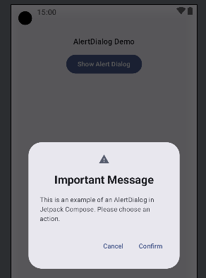
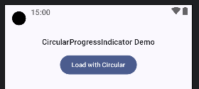
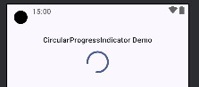
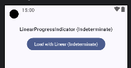
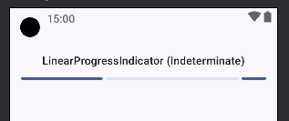

## Components Demonstrated:

1. **AlertDialog Demo:**
    * `AlertDialog` (AlertDialog Demo)`

```kotlin
@Composable
fun DialogDemo() {
   val context = LocalContext.current
   // --- State for AlertDialog ---
   // `showAlertDialog` controls the visibility of the AlertDialog.
   var showAlertDialog by remember { mutableStateOf(false) }

   // --- AlertDialog Section ---
   Text("AlertDialog Demo", style = MaterialTheme.typography.titleMedium)
   Button(onClick = { showAlertDialog = true }) {
      Text("Show Alert Dialog")
   }

   // --- AlertDialog Composable ---
   if (showAlertDialog) {
      // `AlertDialog` is a standard Material Design dialog.
      // It's modal and typically used for critical information or decisions.
      AlertDialog(
         onDismissRequest = {
            // Called when the user tries to dismiss the dialog by clicking outside
            // or pressing the back button. Setting `showAlertDialog` to false closes it.
            showAlertDialog = false
            Toast.makeText(context, "Alert Dismissed", Toast.LENGTH_SHORT).show()
         },
         // `icon` Composable for an optional icon at the top of the dialog.
         icon = { Icon(Icons.Filled.Warning, contentDescription = "Warning Icon") },
         // `title` Composable for the dialog's title.
         title = {
            Text(text = "Important Message", fontWeight = FontWeight.Bold)
         },
         // `text` Composable for the main body content of the dialog.
         text = {
            Text("This is an example of an AlertDialog in Jetpack Compose. Please choose an action.")
         },
         // `confirmButton` Composable for the primary action button.
         confirmButton = {
            TextButton(
               onClick = {
                  showAlertDialog = false
                  Toast.makeText(context, "Confirmed!", Toast.LENGTH_SHORT).show()
                  // Perform confirm action here
               }
            ) {
               Text("Confirm")
            }
         },
         // `dismissButton` Composable for an optional secondary action button.
         dismissButton = {
            TextButton(
               onClick = {
                  showAlertDialog = false
                  Toast.makeText(context, "Cancelled", Toast.LENGTH_SHORT).show()
                  // Perform dismiss action here
               }
            ) {
               Text("Cancel")
            }
         }
         // Other parameters like `shape`, `containerColor`, `tonalElevation` can be used for customization.
      )
   }
}
```



-----

2. **CircularProgressIndicator Demo:**
   * `CircularProgressIndicator` (CircularProgressIndicator Demo)`

```kotlin
@Composable
fun CircularProgressIndicatorDemo() {

   val context = LocalContext.current
   val coroutineScope = rememberCoroutineScope()

   // --- State for Progress Indicators ---
   // `isLoadingCircular` controls the visibility of the CircularProgressIndicator.
   var isLoadingCircular by remember { mutableStateOf(false) }

   // --- CircularProgressIndicator Section ---
   Text("CircularProgressIndicator Demo", style = MaterialTheme.typography.titleMedium)
   if (isLoadingCircular) {
      // `CircularProgressIndicator` displays an indeterminate circular loading animation.
      // It's used when the progress duration is unknown.
      CircularProgressIndicator(
         modifier = Modifier.size(48.dp),
         // color = MaterialTheme.colorScheme.secondary, // Optional: Custom color
         // strokeWidth = 5.dp // Optional: Custom stroke width
      )
   } else {
      Button(onClick = {
         isLoadingCircular = true
         coroutineScope.launch {
            delay(13000) // Simulate a network request or long task.
            isLoadingCircular = false
            Toast.makeText(context, "Circular loading finished!", Toast.LENGTH_SHORT).show()
         }
      }) {
         Text("Load with Circular")
      }
   }
}
```




-----

3. **LinearProgressIndicator Demo:**
   * `LinearProgressIndicator` (LinearProgressIndicator Demo)`

```kotlin
@Composable
fun LinearProgressIndicatorDemo() {
   val context = LocalContext.current
   val coroutineScope = rememberCoroutineScope()
   // `isLoadingLinear` controls the visibility of the LinearProgressIndicator (indeterminate).
   var isLoadingLinear by remember { mutableStateOf(false) }

   Text("LinearProgressIndicator (Indeterminate)", style = MaterialTheme.typography.titleMedium)
   if (isLoadingLinear) {
      // `LinearProgressIndicator` (without a `progress` parameter) displays an indeterminate linear animation.
      LinearProgressIndicator(
         modifier = Modifier.fillMaxWidth()
         // color = MaterialTheme.colorScheme.tertiary, // Optional: Custom color
         // trackColor = MaterialTheme.colorScheme.surfaceVariant, // Optional: Custom track color
      )
   } else {
      Button(onClick = {
         isLoadingLinear = true
         coroutineScope.launch {
            delay(3000) // Simulate a task.
            isLoadingLinear = false
            Toast.makeText(context, "Linear loading finished!", Toast.LENGTH_SHORT).show()
         }
      }) {
         Text("Load with Linear (Indeterminate)")
      }
   }
}
```




-----