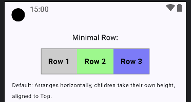
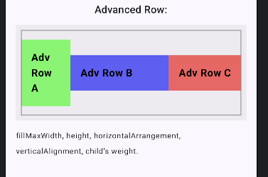

## Components Demonstrated:

1. **Simple Row Demo:**
   * `Row` (Simple Row)`

```kotlin
// --- 1. Minimal/Default Code ---
@Composable
fun MinimalRowLayoutsDemo() {
   // Minimal Row
   Text("Minimal Row:", style = MaterialTheme.typography.titleMedium)
   Row(modifier = Modifier.border(1.dp, Color.Gray)) {
      DemoElement("Row 1", Color.LightGray)
      DemoElement("Row 2", Color.Green.copy(alpha = 0.5f))
      DemoElement("Row 3", Color.Blue.copy(alpha = 0.5f))
   }
   Text("Default: Arranges horizontally, children take their own height, aligned to Top.", fontSize = 12.sp, modifier = Modifier.padding(bottom = 12.dp))

   Spacer(modifier = Modifier.height(16.dp))
}
// --- Helper Composable for consistent item styling ---
// (Assuming MinimalLayoutsDemo and AdvancedLayoutsDemo are in the same file or accessible)00
@Composable
fun DemoElement(text: String, color: Color, modifier: Modifier = Modifier) {
   Text(
      text = text,
      color = Color.Black,
      fontWeight = FontWeight.Bold,
      fontSize = 16.sp,
      modifier = modifier
         .background(color)
         .padding(16.dp)
   )
}
```



-----

2. **Advanced Row Demo:**
    * `Row` (Advanced Row)`

```kotlin
@Composable
fun AdvancedRowLayoutsDemo() {
   // Advanced Row
   Text("Advanced Row:", style = MaterialTheme.typography.titleMedium)
   Row(
      modifier = Modifier
         .fillMaxWidth()
         .height(150.dp)
         .background(Color.LightGray.copy(alpha = 0.3f))
         .padding(8.dp)
         .border(1.dp, Color.Gray),
      horizontalArrangement = Arrangement.SpaceBetween, // Distribute space
      verticalAlignment = Alignment.CenterVertically    // Align children vertically to the center
   ) {
      DemoElement(
         "Adv Row A",
         Color.Green.copy(alpha = 0.6f),
         Modifier.weight(1f)
      ) // Takes 1 part of available space
      DemoElement(
         "Adv Row B",
         Color.Blue.copy(alpha = 0.6f),
         Modifier.weight(2f)
      ) // Takes 2 parts of available space
      DemoElement(
         "Adv Row C",
         Color.Red.copy(alpha = 0.6f),
      ) // Default weight (wraps content)
   }
   Text("fillMaxWidth, height, horizontalArrangement, verticalAlignment, child's weight.", fontSize = 12.sp, modifier = Modifier.padding(bottom = 12.dp))

   Spacer(modifier = Modifier.height(16.dp))
}
```



-----