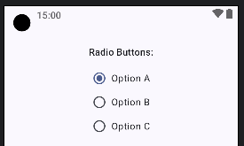
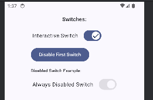

## Components Demonstrated:

1. **ExposedDropdownMenuDemo:**
    * `ExposedDropdownMenu` (ExposedDropdownMenu Text)`

```kotlin
@Composable
fun DropdownMenuDemo(context: android.content.Context) {
   var expanded by remember { mutableStateOf(false) }
   val suggestions = listOf("Apple", "Banana", "Cherry", "Date", "Elderberry")
   var selectedText by remember { mutableStateOf(suggestions[0]) }

   Text("Exposed Dropdown Menu (Spinner Style):", style = MaterialTheme.typography.titleMedium)
   ExposedDropdownMenuBox(
      expanded = expanded,
      onExpandedChange = { expanded = !expanded }
   ) {
      OutlinedTextField(
         value = selectedText,
         onValueChange = { /* Usually read-only or type to filter */ },
         readOnly = true,
         label = { Text("Fruit") },
         trailingIcon = { ExposedDropdownMenuDefaults.TrailingIcon(expanded = expanded) },
         modifier = Modifier
            .menuAnchor() // This is important!
            .fillMaxWidth()
      )
      ExposedDropdownMenu(
         expanded = expanded,
         onDismissRequest = { expanded = false }
      ) {
         suggestions.forEach { label ->
            DropdownMenuItem(
               text = { Text(text = label) },
               onClick = {
                  selectedText = label
                  expanded = false
                  Toast.makeText(context, "Selected: $label", Toast.LENGTH_SHORT).show()
               }
            )
         }
      }
   }
}
```


-----

2. **CheckBoxDemo:**
   * `Checkbox` (Checkbox Text)`

```kotlin
@Composable
fun CheckboxDemo(context: android.content.Context) {
   var checkedState by remember { mutableStateOf(true) }
   var triState by remember { mutableStateOf(androidx.compose.ui.state.ToggleableState.Indeterminate) }

   Text("Checkboxes:", style = MaterialTheme.typography.titleMedium)
   Row(
      verticalAlignment = Alignment.CenterVertically,
      modifier = Modifier
         //.fillMaxWidth() // REMOVED - Row will now wrap its content//It Makes the whole row take width
         .toggleable(
            value = checkedState,
            onValueChange = {
               checkedState = it
               Toast
                  .makeText(context, "Checkbox: $it", Toast.LENGTH_SHORT)
                  .show()
            },
            role = Role.Checkbox // Important for accessibility
         )
         .padding(vertical = 8.dp) // Add some padding for better tap target
   ) {
      Checkbox(
         checked = checkedState,
         onCheckedChange = null
      )
      Text(
         text = "Simple Checkbox",
         modifier = Modifier.padding(start = 8.dp) // Padding between checkbox and text
      )
   }

   // Tri-State Checkbox Row - Wrap Content
   Row(
      verticalAlignment = Alignment.CenterVertically,
      modifier = Modifier
         .clickable( // Using clickable for simpler TriState logic handling from Row
            onClick = {
               val newState = when (triState) {
                  ToggleableState.On -> ToggleableState.Off
                  ToggleableState.Off -> ToggleableState.Indeterminate
                  ToggleableState.Indeterminate -> ToggleableState.On
               }
               triState = newState
               Toast
                  .makeText(context, "TriStateCheckbox: $newState", Toast.LENGTH_SHORT)
                  .show()
            },
            role = Role.Checkbox,
            interactionSource = remember { MutableInteractionSource() },
            indication = ripple(
               bounded = true,
               radius = Dp.Unspecified, // Or specific Dp value
               color = Color.Unspecified // Or specific Color
            ) // NEW WAY
         )
         .padding(vertical = 8.dp, horizontal = 4.dp) // Added small horizontal padding
   ) {
      TriStateCheckbox(
         state = triState,
         onClick = null // Handled by clickable Row
      )
      Text(
         text = "Tri-State Checkbox",
         modifier = Modifier.padding(start = 8.dp)
      )
   }
}
```


-----

3. **RadioButtonDemo:**
   * `RadioButton` (RadioButton Demo)`

```kotlin
@Composable
fun RadioButtonDemo(context: android.content.Context) {
   val radioOptions = listOf("Option A", "Option B", "Option C")
   // var (selectedOption, onOptionSelected) = remember { mutableStateOf(radioOptions[0]) }
   var selectedOption by remember { mutableStateOf(radioOptions[0]) }
   Text("Radio Buttons:", style = MaterialTheme.typography.titleMedium)
   Column {
      radioOptions.forEach { text ->
         Row(
            Modifier
               //.fillMaxWidth()
               .selectable(
                  selected = (text == selectedOption),
                  onClick = {
                     selectedOption = text // Update state directly here
                     Toast
                        .makeText(context, "$text selected", Toast.LENGTH_SHORT)
                        .show()
                  },
                  role = Role.RadioButton // Important for accessibility
               )
               .padding(vertical = 8.dp), // Increased padding for better tap target
            verticalAlignment = Alignment.CenterVertically
         ) {
            RadioButton(
               selected = (text == selectedOption),
//                    onClick = {
//                        onOptionSelected(text)
//                        Toast.makeText(context, "$text selected", Toast.LENGTH_SHORT).show()
//                    }
               onClick = null // Handled by the Row's selectable modifier
            )
            Text(
               text = text,
               modifier = Modifier.padding(start = 8.dp)// Padding between radio and text
            )
         }
      }
   }
}
```



-----

4. **Switch Demo:**
   * `Switch` (Switch Demo)`

```kotlin
@Composable
fun SwitchDemo(context: android.content.Context) {
   var simpleSwitchChecked by remember { mutableStateOf(false) }
   var disabledSwitchChecked by remember { mutableStateOf(true) } // Example initial state for disabled
   var isSwitchEnabled by remember { mutableStateOf(true) } // To control enabled state of the first switch

   Text("Switches:", style = MaterialTheme.typography.titleMedium)

   // Example 1: Standard Switch (that can be programmatically disabled/enabled)
   Column(modifier = Modifier.padding(bottom = 16.dp)) {
      Row(
         verticalAlignment = Alignment.CenterVertically,
         modifier = Modifier
            // .fillMaxWidth() // Optional: uncomment if you want the row to span full width
            .toggleable(
               value = simpleSwitchChecked,
               onValueChange = {
                  if (isSwitchEnabled) { // Only change if enabled
                     simpleSwitchChecked = it
                     Toast.makeText(context, "Switch: $it", Toast.LENGTH_SHORT).show()
                  } else {
                     Toast.makeText(context, "Switch is disabled", Toast.LENGTH_SHORT).show()
                  }
               },
               role = Role.Switch, // Important for accessibility
               enabled = isSwitchEnabled // Pass the enabled state to toggleable
            )
            .padding(vertical = 8.dp, horizontal = 4.dp) // Padding for better tap target
      ) {
         // The Text should ideally come before the Switch for typical LTR layout ordering
         // if the whole row is clickable and associated with the Switch's state.
         Text(
            text = "Interactive Switch",
            modifier = Modifier.padding(end = 16.dp) // Padding between text and switch
         )
         Switch(
            checked = simpleSwitchChecked,
            onCheckedChange = null, // Handled by Row's toggleable
            enabled = isSwitchEnabled, // Control enabled state here
            // Example of thumb icon (optional)
            thumbContent = {
               if (simpleSwitchChecked) Icon(Icons.Filled.Check, "On") else Icon(
                  Icons.Filled.Close,
                  "Off"
               )
            }

            // If you want a thumb icon, you can add it here:
            // thumbContent = { if (switchCheckedState) Icon(...) else Icon(...) }
         )
      }
      Button(
         onClick = { isSwitchEnabled = !isSwitchEnabled },
         modifier = Modifier.padding(top = 8.dp)
      ) {
         Text(if (isSwitchEnabled) "Disable First Switch" else "Enable First Switch")
      }
      Spacer(modifier = Modifier.height(16.dp))

      // Example 2: Permanently Disabled Switch
      Text("Disabled Switch Example:", style = MaterialTheme.typography.labelMedium)
      Row(
         verticalAlignment = Alignment.CenterVertically,
         modifier = Modifier
            // Not toggleable if it's meant to be permanently disabled for this demo part
            // If it were conditionally disabled but still part of a form, toggleable(enabled=false) is good.
            .padding(vertical = 8.dp, horizontal = 4.dp)
      ) {
         Text(
            text = "Always Disabled Switch",
            modifier = Modifier.padding(end = 16.dp)
         )
         Switch(
            checked = disabledSwitchChecked, // The visual state it's stuck in
            onCheckedChange = { /* This won't be called if enabled is false */ },
            enabled = false // THIS MAKES THE SWITCH DISABLED
         )
      }
   }
}
```



-----
