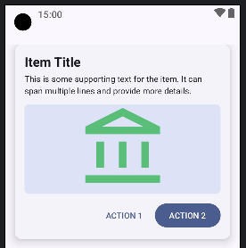
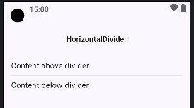
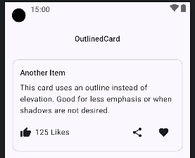
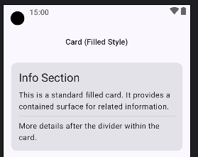

## Components Demonstrated:

1. **ElevatedCard:**
    * `ElevatedCard` (ElevatedCard)`

```kotlin

@Composable
fun ElevatedCardDemo(context: android.content.Context) {
   ElevatedCard(
      // `onClick` can be added to make the entire card clickable.
      onClick = { Toast.makeText(context, "Elevated Card clicked!", Toast.LENGTH_SHORT).show() },
      modifier = Modifier
         .fillMaxWidth(),
      elevation = CardDefaults.cardElevation(defaultElevation = 8.dp)
   ) {
      Column(
         modifier = Modifier
            .padding(16.dp) // Padding inside the card
            .fillMaxWidth()
      ) {
         Text(
            text = "Item Title",
            style = MaterialTheme.typography.titleLarge,
            fontWeight = FontWeight.Bold
         )
         Spacer(modifier = Modifier.height(4.dp))
         Text(
            text = "This is some supporting text for the item. It can span multiple lines and provide more details.",
            style = MaterialTheme.typography.bodyMedium
         )
         Spacer(modifier = Modifier.height(12.dp))
         // Example of an image placeholder within a card.
         ImagePlaceholder()
         Spacer(modifier = Modifier.height(12.dp))
         Row(
            modifier = Modifier.fillMaxWidth(),
            horizontalArrangement = Arrangement.End
         ) {
            TextButton(onClick = { Toast.makeText(context, "Action 1", Toast.LENGTH_SHORT).show() }) {
               Text("ACTION 1")
            }
            Spacer(modifier = Modifier.width(8.dp))
            Button(onClick = { Toast.makeText(context, "Action 2", Toast.LENGTH_SHORT).show() }) {
               Text("ACTION 2")
            }
         }
      }
   }
}
// Simple placeholder for an image within a card.
@Composable
fun ImagePlaceholder(modifier: Modifier = Modifier) {
   Box(
      modifier = modifier
         .fillMaxWidth()
         .height(150.dp)
         .clip(RoundedCornerShape(8.dp)) // Rounded corners for the placeholder
         .background(MaterialTheme.colorScheme.secondaryContainer),
      contentAlignment = Alignment.Center
   ) {
      Image(
         painter = painterResource(id = R.drawable.ic_home_144),
         contentDescription = "Descriptive text",
         contentScale = ContentScale.FillHeight,
         modifier = Modifier.fillMaxSize()
      )
   }
}
```



-----

2. **HorizontalDivider:**
   * `HorizontalDivider` (HorizontalDivider)`

```kotlin
@Composable
fun HorizontalDividerDemo() {
    Text("HorizontalDivider", style = MaterialTheme.typography.titleMedium)
    Spacer(modifier = Modifier.height(8.dp))
    Column {
        Text("Content above divider")
        Spacer(modifier = Modifier.height(8.dp))
        // `HorizontalDivider` is used to separate content horizontally.
        // It's the standard Material 3 divider for this purpose.
        HorizontalDivider(
            modifier = Modifier.fillMaxWidth(), // Typically spans the full width
            thickness = 1.dp, // Default thickness
            color = MaterialTheme.colorScheme.outlineVariant // Default color
        )
        // `HorizontalDivider(thickness = Dp.Hairline)` can be used for a very thin line.
        Spacer(modifier = Modifier.height(8.dp))
        Text("Content below divider")
    }
}
```



-----

3. **OutlinedCard:**
   * `OutlinedCard` (OutlinedCard)`

```kotlin
@Composable
fun OutlinedCardDemo(context: Context) {
   Text("OutlinedCard", style = MaterialTheme.typography.titleMedium)
   Spacer(modifier = Modifier.height(8.dp))
   // `OutlinedCard` is a card with a visible border instead of elevation/shadow.
   OutlinedCard(
      onClick = { Toast.makeText(context, "Outlined Card clicked!", Toast.LENGTH_SHORT).show() },
      modifier = Modifier
         .fillMaxWidth(),
      // `border` can be customized using `BorderStroke`.
//         border = BorderStroke(1.dp, MaterialTheme.colorScheme.primary)
      // `colors` can be customized, e.g., for container color.
      // colors = CardDefaults.outlinedCardColors(containerColor = MaterialTheme.colorScheme.surfaceVariant)
   ) {
      Column(modifier = Modifier.padding(16.dp).fillMaxWidth()) {
         Text("Another Item", style = MaterialTheme.typography.titleMedium)
         Spacer(modifier = Modifier.height(8.dp))
         Text("This card uses an outline instead of elevation. Good for less emphasis or when shadows are not desired.")
         Spacer(modifier = Modifier.height(10.dp))
         Row(
            verticalAlignment = Alignment.CenterVertically,
            horizontalArrangement = Arrangement.spacedBy(8.dp)
         ) {
            Icon(Icons.Filled.ThumbUp, contentDescription = "Like")
            Text("125 Likes")
            Spacer(Modifier.weight(1f)) // Pushes content to sides
            IconButton(onClick = { Toast.makeText(context, "Share clicked", Toast.LENGTH_SHORT).show() }) {
               Icon(Icons.Filled.Share, contentDescription = "Share")
            }
            IconButton(onClick = { Toast.makeText(context, "Favorite clicked", Toast.LENGTH_SHORT).show() }) {
               Icon(Icons.Filled.Favorite, contentDescription = "Favorite")
            }
         }
      }
   }
}
```



-----


4. **CardFilledStyle:**
   * `CardFilledStyle` (CardFilledStyle)`

```kotlin
@Composable
fun CardFilledStyleDemo(context: Context) {
   Text("Card (Filled Style)", style = MaterialTheme.typography.titleMedium)
   Spacer(modifier = Modifier.height(8.dp))
   // The general `Card` composable can be used for a "filled" style card,
   // which is subtly different from ElevatedCard (less prominent shadow by default)
   // or OutlinedCard. It's closer to the M2 `Card`.
   Card(
      onClick = { Toast.makeText(context, "Filled Card clicked!", Toast.LENGTH_SHORT).show() },
      modifier = Modifier
         .fillMaxWidth(),
      // `colors` can be used to set a specific container color.
      // colors = CardDefaults.cardColors(containerColor = MaterialTheme.colorScheme.surfaceVariant)
      // `elevation` can also be set here, but for stronger shadow, ElevatedCard is preferred.
      // elevation = CardDefaults.cardElevation(defaultElevation = 2.dp)
   ) {
      Column(modifier = Modifier.padding(16.dp).fillMaxWidth()) {
         Text("Info Section", style = MaterialTheme.typography.headlineSmall)
         Spacer(modifier = Modifier.height(8.dp))
         Text("This is a standard filled card. It provides a contained surface for related information.")
         Spacer(modifier = Modifier.height(8.dp))
         // Divider inside a card
         HorizontalDivider()
         Spacer(modifier = Modifier.height(8.dp))
         Text("More details after the divider within the card.")
      }
   }
}
```



-----